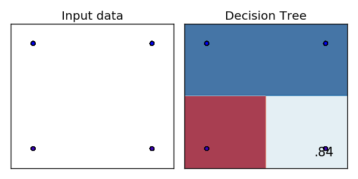
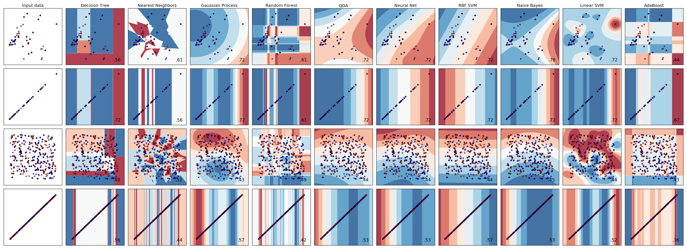

# Predicting player accuracy

## Prerequisite

[Predicting player retention](../README.md)

## Classifying correctness

How well would would SciKit Learn classify correctness of problem number 5?

### Dataset

Adaptive Learning published datasets of MatMat:
<http://www.fi.muni.cz/adaptivelearning/?a=data>

Described here:
<https://github.com/adaptive-learning/matmat-web/blob/master/data/data_description.md>

Downloaded here:
<http://www.fi.muni.cz/adaptivelearning/data/matmat/>

Adaptive Learning modeled arithmetic skill.
<http://www.fi.muni.cz/adaptivelearning/documents/matmat-model.pdf>

Adaptive Learning published a prediction algorithm.
<https://github.com/adaptive-learning/matmat-web/blob/master/matmat/prediction.py>

### Outline

Aggregate students into their first five answers for students with five answers or more.

For each student answer:
    item
    response_time
    correct

Split students into training and test datasets.

All columns except 5th answer correct are potential features.

5th answer correct is the target.

Select two best features.

Score the model.

### Results

Decision tree, neural net, and some others predicted with a score of 0.84 by the value by the correctness of answers 4 and 5.  Random prediction would score 0.50.  So there is about a 1 in 6 chance of being wrong in this sample.

Example decision tree:

### Details

#### Aggregating students

Install MatMat dataset into directory:

    data

There is an answers CSV there:

    >>> from os.path import exists
    >>> exists('data/answers.csv')
    True

To aggregate first few student answers:

    python accuracy.py --aggregate_path data/student_answers.csv data/answers.csv

That can take a while.  To quickly test, aggregated students by correct, response time, and item in first 2 answers.

    >>> from accuracy import *
    >>> accuracy_csv_string('--aggregate_path test/student_answers_sample.csv test/answers_sample.csv --answer_count 2')
    >>> lines = open('test/student_answers_sample.csv').readlines()
    >>> print(''.join(lines[0:5]))
    correct_0,correct_1,item_0,item_1,response_time_0,response_time_1,student,correct_mean,response_time_mean
    1,1,54,56,15060,9735,33183,1.0,15060.0
    1,1,2,22,45203,63256,33184,1.0,45203.0
    0,0,38,51,57276,17068,33480,0.0,57276.0
    0,1,685,148,19878,12359,33481,0.0,19878.0
    <BLANKLINE>

#### Plotting accuracy prediction

    bash accuracy.sh

Quick example of usage:

    >>> accuracy_csv_string('--plot test/student_answers_sample.csv --answer_count 2') #doctest: +ELLIPSIS
    features_classes: features: ['correct_0', 'item_0', 'item_1', 'response_time_0', 'response_time_1', 'correct_mean', 'response_time_mean']
    ...
    plot_comparison: Saved figure to: 'test/student_answers_sample.csv.png'

## Future directions

Aggregate accuracy of 5 answers is 82%.  The decision tree predicts 84% of the time.  The difference between the predictor and mean accuracy is negligible.

    >>> print(accuracy_csv_string('--summarize test/student_answers_sample.csv --answer_count 2'))
    accuracy
    0.76

9 answers did not better predict 10th answer.

Mean accuracy in 9 answers did not better predict 10th answer.

Mean response time in 9 answers did not better predict 10th answer.

Principal component analysis did not better predict 10th answer.
<https://www.analyticsvidhya.com/blog/2016/03/practical-guide-principal-component-analysis-python/>
<https://plot.ly/ipython-notebooks/principal-component-analysis/>
<http://scikit-learn.org/stable/modules/generated/sklearn.decomposition.PCA.html>

    >>> accuracy_csv_string('--pca --plot test/student_answers_sample.csv --answer_count 2') #doctest: +ELLIPSIS
    Cumulative variance explained with number of components:
    ...
    features_classes: features: ['component_0', 'component_1']
    ...
    plot_comparison: Saved figure to: 'test/student_answers_sample.csv.png'

8 principal components did not better predict 10th answer than 2 components.

Principal component analysis needs more samples and features than components, so here is an example with 4 components on 2 answers.

    >>> print(accuracy_csv_string('--pca --feature_count 4 --plot test/student_answers_sample.csv --answer_count 2')) #doctest: +ELLIPSIS
    AdaBoost 0.61

Running on the dataset also yielded at most score of 86%.

    bash accuracy.sh

## Retention

[answer\_retention.md](answer_retention.py)

# Related work

Adaptive Learning published datasets of geography, arithmetic, and anatomy.
<http://www.fi.muni.cz/adaptivelearning/?a=data>

The arithmetic data set has an intuitive measurement of problem difficulty.

Adaptive Learning experimented with the target accuracy to conclude easier questions engage immediately and harder questions engage after 10 hours.
<http://www.fi.muni.cz/~xpelanek/publications/its-target-difficulty.pdf>

They made the data available.
<http://www.fi.muni.cz/adaptivelearning/data/slepemapy/2016-ab-target-difficulty.zip>

Adaptive Learning has studied adaptive practice, student modeling and problem solving times.
<http://www.fi.muni.cz/adaptivelearning/?a=publications>

Adaptive Learning modeled problem solving times with an iterative estimation of problem difficulty, discrimination, chance solution, and student ability.
<http://www.fi.muni.cz/~xpelanek/publications/sofsem12.pdf>
